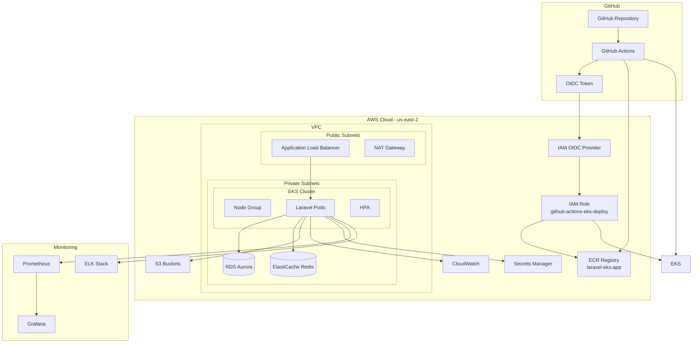

# 🚀 Laravel EKS - Infraestrutura DevOps Completa

## 📋 Sumário
- [Visão Geral](#visão-geral)
- [Arquitetura](#arquitetura)
- [Estrutura do Projeto](#estrutura-do-projeto)
- [Pré-requisitos](#pré-requisitos)
- [Quick Start](#quick-start)
- [Etapas Detalhadas](#etapas-detalhadas)
- [Estratégia de CI/CD](#estratégia-de-cicd)
- [Estratégia de Observabilidade](#estratégia-de-observabilidade)
- [Segurança](#segurança)
- [Troubleshooting](#troubleshooting)

## 🎯 Visão Geral

Este projeto demonstra a implementação completa de uma aplicação Laravel em produção usando:
- **Containerização** com Docker (multi-stage build otimizado)
- **Orquestração** com Kubernetes (EKS)
- **IaC** com Terraform
- **CI/CD** com GitHub Actions
- **Observabilidade** com Prometheus, Grafana e ELK

### Decisões Técnicas Principais

| Componente | Tecnologia Escolhida | Justificativa |
|------------|---------------------|---------------|
| Container Runtime | Docker | Padrão de mercado, melhor suporte |
| Orquestração | EKS | Gerenciado pela AWS, menos overhead operacional |
| IaC | Terraform | Multi-cloud, estado gerenciado, módulos reutilizáveis |
| CI/CD | GitHub Actions + OIDC | Integração nativa, sem secrets, autenticação segura |
| Container Registry | Amazon ECR | Scan automático, integração AWS, menor latência |
| Autenticação AWS | OIDC Provider | Zero secrets no GitHub, credenciais temporárias |
| Database | RDS Aurora Serverless v2 | Auto-scaling, backup automático, alta disponibilidade |
| Cache | ElastiCache Redis | Gerenciado, Multi-AZ, backup automático |
| Monitoring | Prometheus + Grafana | Open source, integração com Kubernetes |

## 🏗️ Arquitetura



## 📁 Estrutura do Projeto

```bash
eks/
├── src/                          # Aplicação Laravel
│   ├── app/
│   │   └── Http/
│   │       └── Controllers/
│   │           ├── HealthController.php   # Health checks
│   │           └── MetricsController.php  # Métricas Prometheus
│   └── routes/
│       ├── web.php              # Rotas incluindo /health, /metrics
│       └── api.php              # API routes
│
├── infrastructure/
│   ├── terraform/               # Infraestrutura como código
│   │   ├── main.tf             # Configuração principal
│   │   ├── variables.tf        # Variáveis
│   │   ├── outputs.tf          # Outputs
│   │   ├── vpc.tf              # Networking
│   │   ├── eks.tf              # Cluster EKS
│   │   ├── rds.tf              # Database
│   │   └── elasticache.tf      # Redis
│   │
│   └── k8s/                     # Manifestos Kubernetes
│       ├── deployment.yaml      # Deploy da aplicação
│       ├── service.yaml         # Services
│       ├── configmap.yaml       # Configurações
│       ├── secret.yaml          # Secrets
│       ├── hpa.yaml            # Auto-scaling
│       ├── ingress.yaml        # Ingress rules
│       ├── storage.yaml        # PVC para storage
│       └── redis-deployment.yaml # Redis no cluster (opcional)
│
├── .github/
│   └── workflows/
│       └── main.yml            # Pipeline CI/CD (OIDC)
│
├── scripts/
│   ├── create-ecr-repository.sh        # Cria repositório ECR
│   ├── create-github-oidc-role.sh      # Cria role IAM com OIDC
│   ├── trust-policy.json               # Trust policy GitHub OIDC
│   ├── ecr-policy.json                 # Permissões ECR
│   └── eks-policy.json                 # Permissões EKS
│
├── Dockerfile                  # Multi-stage build
├── docker-compose.yml         # Desenvolvimento local
├── nginx.conf                 # Config Nginx
├── supervisord.conf           # Supervisor para múltiplos processos
├── docker-entrypoint.sh      # Script de inicialização
└── CI-CD-SETUP.md            # Documentação CI/CD com OIDC

```

## ⚙️ Pré-requisitos

- AWS CLI configurado
- Terraform >= 1.5
- kubectl >= 1.28
- Docker >= 24.0
- PHP >= 8.3
- Composer >= 2.0

## 🚀 Quick Start

### 1. Clone o repositório
```bash
git clone git@github.com:cristianorodrigues25/eks.git
cd eks
```

### 2. Configure CI/CD com OIDC (GitHub Actions)
```bash
# Criar repositório ECR
chmod +x scripts/create-ecr-repository.sh
export AWS_PROFILE=ntw-adm
./scripts/create-ecr-repository.sh

# Criar IAM Role com OIDC
chmod +x scripts/create-github-oidc-role.sh
./scripts/create-github-oidc-role.sh
```

**Nota:** Não é necessário configurar AWS Access Keys no GitHub!

### 3. Configure as variáveis de ambiente
```bash
cp terraform.tfvars.example terraform.tfvars
# Edite terraform.tfvars com suas configurações
```

### 4. Deploy da infraestrutura
```bash
cd infrastructure/terraform
terraform init
terraform plan
terraform apply -auto-approve
```

### 5. Configure kubectl
```bash
aws eks update-kubeconfig --name laravel-eks-cluster --region us-east-2
```

### 6. Deploy da aplicação
```bash
kubectl apply -f infrastructure/k8s/
```

## 📝 Etapas Detalhadas

### Etapa 1: Containerização ✅

**Dockerfile multi-stage otimizado:**
- Stage 1: Base com PHP 8.3 e extensões
- Stage 2: Composer dependencies
- Stage 3: Build da aplicação
- Stage 4: Imagem final de produção

**Otimizações implementadas:**
- Multi-stage build (reduz tamanho em ~70%)
- Usuário não-root (segurança)
- OPcache configurado
- Health check integrado
- Cache de layers

### Etapa 2: Pipeline CI/CD ✅

**GitHub Actions com OIDC:**
- **Autenticação:** OIDC Provider (sem secrets AWS!)
- **Testes:** PHPUnit + Laravel Pint + Composer Audit
- **Build:** Docker multi-stage para Amazon ECR
- **Segurança:** Trivy scan + SARIF upload
- **Deploy:** Automático via PR merged (develop → staging)
- **Região:** us-east-2
- **Role IAM:** `github-actions-eks-deploy`

### Etapa 3: Infraestrutura como Código ✅

**Terraform provisionando:**
- VPC com subnets públicas/privadas
- EKS cluster com node groups (on-demand + spot)
- RDS Aurora Serverless v2 (MySQL 8.0)
- ElastiCache Redis cluster
- IAM roles com princípio do menor privilégio
- Secrets Manager para credenciais
- S3 para storage e backups

**Kubernetes com:**
- Deployments com rolling updates
- Services (LoadBalancer e ClusterIP)
- ConfigMaps e Secrets
- HPA para auto-scaling
- Ingress com SSL/TLS
- PVC para storage persistente

## 🔄 Estratégia de CI/CD

### Modelo de Branches

```
develop → staging
   ↓         ↓
 Dev      EKS (laravel-eks-cluster)
```

### Pipeline de Integração Contínua

**Trigger:** Pull Request de `develop` para `staging` (merged/closed)

```yaml
1. 🔐 Autenticação OIDC
   ↓ (GitHub → AWS STS → Credenciais temporárias)
2. 🧪 Testes e Qualidade
   ├─ Setup PHP 8.3 + MySQL
   ├─ Composer install (com cache)
   ├─ PHPUnit tests
   ├─ Laravel Pint (code style)
   └─ Composer audit (vulnerabilidades)
   ↓
3. 🐳 Build Docker
   ├─ Login Amazon ECR (OIDC)
   ├─ Multi-stage build
   ├─ Tags automáticas (sha, branch, latest)
   └─ Push para ECR us-east-2
   ↓
4. 🔒 Análise de Segurança
   ├─ Trivy scan (CRITICAL/HIGH)
   ├─ Upload SARIF → GitHub Security
   └─ Composer audit
   ↓
5. 🚀 Deploy EKS (se PR merged de develop → staging)
   ├─ Update kubeconfig (laravel-eks-cluster)
   ├─ kubectl set image deployment/laravel-app
   ├─ Rollout status
   └─ Health checks (readiness/liveness probes)
```

### Fluxo de Trabalho Completo

```
Developer → Commit develop
     ↓
Cria PR: develop → staging
     ↓
Code Review + Aprovação
     ↓
Merge PR (trigger CI/CD)
     ↓
Pipeline executa automaticamente:
  ├─ Testes (PHPUnit + Pint + Audit)
  ├─ Build → ECR (laravel-eks-app)
  ├─ Security Scan (Trivy + SARIF)
  └─ Deploy → EKS (laravel-eks-cluster)
     ↓
Aplicação rodando no EKS ✅
  ├─ Health checks OK
  ├─ Metrics disponíveis
  └─ Logs centralizados
```

### Estratégia de Rollback

- **Automático**: Se health checks falham por 3 minutos
- **Manual**: `kubectl rollout undo deployment/laravel-app`
- **Histórico**: Mantém últimas 10 revisões

## 📊 Estratégia de Observabilidade

### Stack de Monitoramento

#### 1. **Métricas (Prometheus + Grafana)**

**Coleta de métricas:**
- Application metrics via `/metrics` endpoint
- Kubernetes metrics (kube-state-metrics)
- Node metrics (node-exporter)
- Custom business metrics

**3 Métricas Principais:**

| Métrica | Descrição | Threshold de Alerta |
|---------|-----------|---------------------|
| **Request Rate & Latency** | P95 e P99 de latência das requisições | P95 > 500ms, P99 > 1s |
| **Error Rate** | Taxa de erros 4xx e 5xx | > 1% em 5 minutos |
| **Resource Usage** | CPU, Memória e Pods ativos | CPU > 80%, Memory > 85% |

**Dashboards Grafana:**
```bash
- Application Overview
- Kubernetes Cluster
- Database Performance
- Redis Cache Hit Rate
- Business Metrics
```

#### 2. **Logs (ELK Stack)**

**Elasticsearch + Logstash + Kibana:**
```yaml
Fontes de logs:
  - Application logs (Laravel)
  - Nginx access/error logs
  - PHP-FPM logs
  - Kubernetes events
  - System logs

Processamento:
  - Parsing estruturado
  - Enrichment com metadata
  - Agregação por request ID

Visualização:
  - Dashboard de erros
  - Análise de performance
  - Auditoria de segurança
```

#### 3. **Traces (AWS X-Ray / Jaeger)**

```yaml
Distributed Tracing para:
  - Request flow completo
  - Latência entre serviços
  - Identificação de bottlenecks
  - Dependency mapping
```

### Alertas

**Configurados no AlertManager:**

| Alerta | Condição | Ação |
|--------|----------|------|
| High CPU | > 80% por 5 min | Scale up nodes |
| High Memory | > 85% por 5 min | Scale up pods |
| High Error Rate | > 1% | PagerDuty + Investigação |
| Database Connection Failed | Conexão down | Failover para réplica |
| Redis Down | Conexão falhou | Bypass cache temporário |

### Health Checks

**Endpoints implementados:**
- `/health` - Status completo (DB, Redis, Storage)
- `/ready` - Readiness probe
- `/live` - Liveness probe
- `/metrics` - Métricas Prometheus

## 🔒 Segurança

### Medidas Implementadas

1. **CI/CD Security (OIDC):**
   - ✅ **Zero secrets no GitHub** - Sem AWS Access Keys
   - ✅ **Credenciais temporárias** - STS AssumeRoleWithWebIdentity
   - ✅ **Trust policy restrita** - Apenas repositório específico
   - ✅ **Permissões mínimas** - Least privilege principle
   - ✅ **Auditável** - CloudTrail logs de todas as ações

   **Como funciona:**
   ```
   GitHub Actions → OIDC Token JWT →
   AWS IAM OIDC Provider → Valida token →
   AssumeRole temporário (1h) → ECR/EKS access
   ```

   **Trust Policy:**
   ```json
   {
     "Condition": {
       "StringEquals": {
         "token.actions.githubusercontent.com:aud": "sts.amazonaws.com"
       },
       "StringLike": {
         "token.actions.githubusercontent.com:sub": "repo:cristianorodrigues25/eks:*"
       }
     }
   }
   ```

2. **Container Security:**
   - Imagens escaneadas com Trivy (CRITICAL/HIGH)
   - Usuário não-root (uid 1000)
   - Read-only filesystem onde possível
   - Multi-stage build (reduz surface attack)
   - Base image Alpine (menor e mais segura)

3. **Kubernetes Security:**
   - RBAC configurado
   - Network Policies
   - Pod Security Standards
   - Secrets encryption at rest
   - Service Account com permissões mínimas

4. **AWS Security:**
   - VPC isolada com subnets privadas
   - Security Groups restritivos
   - IAM roles com menor privilégio
   - Secrets Manager para credenciais
   - KMS para criptografia
   - ECR com scan automático

5. **Application Security:**
   - HTTPS/TLS obrigatório
   - Headers de segurança
   - Rate limiting
   - WAF rules (opcional)
   - Composer audit automático

## 🐛 Troubleshooting

### Problemas Comuns

| Problema | Solução |
|----------|---------|
| Pods em CrashLoopBackOff | Verificar logs: `kubectl logs -f pod-name` |
| Alta latência | Verificar HPA e métricas de CPU/Memory |
| Database connection errors | Verificar Security Groups e credenciais |
| Storage issues | Verificar PVC status e EBS/EFS |

### Comandos Úteis

```bash
# Verificar status dos pods
kubectl get pods -n default

# Logs da aplicação
kubectl logs -f deployment/laravel-app

# Acessar pod
kubectl exec -it pod-name -- /bin/sh

# Verificar eventos
kubectl get events --sort-by='.lastTimestamp'

# Rollback deployment
kubectl rollout undo deployment/laravel-app

# Scale manual
kubectl scale deployment/laravel-app --replicas=5

# Verificar métricas
kubectl top pods
kubectl top nodes
```

## 📈 Melhorias Implementadas

### ✅ Já Implementado
1. **OIDC Authentication** - Zero secrets, segurança máxima
2. **Amazon ECR** - Container registry nativo AWS
3. **Branch Strategy** - develop → staging → main
4. **PR-based Deployment** - Deploy apenas em merge
5. **Trivy Security Scan** - Análise automática de vulnerabilidades
6. **GitHub Security Integration** - SARIF upload

### 🚀 Futuras Melhorias
1. **GitOps com ArgoCD** - Deploy declarativo
2. **Service Mesh (Istio)** - Observabilidade avançada
3. **Backup automatizado** - Velero para disaster recovery
4. **Multi-região** - Alta disponibilidade global
5. **Cost Optimization** - Karpenter para auto-scaling mais eficiente
6. **Canary Deployment** - Deploy progressivo com Flagger

## 🤝 Contribuindo

1. Fork o projeto
2. Crie sua feature branch (`git checkout -b feature/AmazingFeature`)
3. Commit suas mudanças (`git commit -m 'Add some AmazingFeature'`)
4. Push para a branch (`git push origin feature/AmazingFeature`)
5. Abra um Pull Request

## 📄 Licença

Este projeto é um teste técnico para fins de demonstração.

## 👤 Autor

**Cristiano Rodrigues**
- GitHub: [@cristianorodrigues25](https://github.com/cristianorodrigues25)

---

## 🔧 Configurações do Projeto

| Configuração | Valor |
|-------------|-------|
| AWS Region | us-east-2 |
| AWS Account ID | 120346103284 |
| EKS Cluster | laravel-eks-cluster |
| ECR Repository | laravel-eks-app |
| IAM Role | github-actions-eks-deploy |
| OIDC Provider | token.actions.githubusercontent.com |
| GitHub Repo | cristianorodrigues25/eks |
| Namespace | default |
| PHP Version | 8.3 |
| Laravel Version | 12.x |

---

**Nota:** Este projeto foi desenvolvido como parte de um teste técnico para Analista DevOps, demonstrando competências em:
- Containerização com Docker multi-stage
- Orquestração com Kubernetes (EKS)
- Infrastructure as Code com Terraform
- CI/CD com GitHub Actions e OIDC
- Segurança (zero secrets, least privilege)
- Observabilidade com Prometheus/Grafana